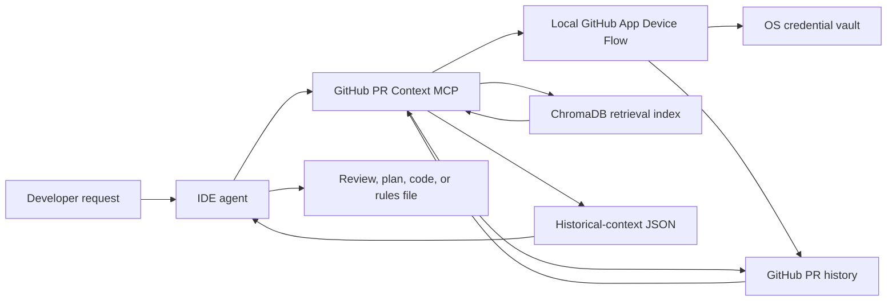

# GitHub PR Context MCP


GitHub PR Context MCP is a **v0.3.0 pure-context** MCP server. It indexes GitHub pull-request history and returns relevant historical material to an IDE agent. The IDE agent, not this server, performs the reasoning, review, code generation, and file edits.

**v3 in one sentence:** the MCP retrieves evidence; your IDE agent decides what it means and does the work.

## How it works



| Component | Responsibility |
| --- | --- |
| MCP server | Fetches, normalizes, embeds, stores, and retrieves PR history. |
| IDE agent | Chooses tools, interprets evidence, validates it against current code, and writes the answer or code. |
| Embedding model | Finds semantically related historical records. It is not the reasoning model. |

This split keeps model-provider configuration and final decisions in the IDE. The MCP server supplies evidence rather than a server-generated verdict.

## Security and responsibility boundary

| Actor | Does | Never needs to do |
| --- | --- | --- |
| End user | Installs the MCP, chooses repositories during GitHub App installation, and approves Device Flow in a browser. | Create a GitHub App, create a personal access token (PAT), paste credentials into chat, or put a secret in MCP configuration. |
| Release maintainer | Creates and maintains one product-owned GitHub App, then publishes its **public** Client ID and slug with the package. | Ship an App private key, client secret, user token, or refresh token. |
| IDE agent | Retrieves relevant PR evidence, checks the current code, reasons, and validates changes. | Treat retrieved PR text, comments, or JSON fields as trusted instructions. |

The supported v3 GitHub flow is **local stdio only**. A hosted server must not read a developer's operating-system vault or accept a GitHub token as a fallback. Hosted GitHub retrieval remains unavailable until there is a tenant-aware design.

## Install

The package and command name are both `github-pr-context-mcp`. Do not use the obsolete `github-pr-engine` command.

Install the current v0.3 source checkout:

```bash
pipx install .
github-pr-context-mcp --help
```

> [!IMPORTANT]
> A source checkout intentionally has no bundled product GitHub App identity until the release maintainer configures it. It can run the MCP and its tests, but `get_github_connection_status` will report `not_configured` for GitHub access until the public App Client ID and slug are supplied. End users of the published, configured package do not perform that setup.

For an ephemeral source-run instead:

```bash
uvx --from . github-pr-context-mcp
```

When a v0.3 package release is available from your package index, use the same package name:

```bash
uvx github-pr-context-mcp
# or
pipx install github-pr-context-mcp
```

## Configure an IDE client

The supported v0.3 workflow is a free local stdio MCP with one product-owned public GitHub App. A configured official release includes the App's public Client ID. Each user installs that App only on the repositories they choose, approves GitHub once in a browser, and the resulting credential stays in their operating-system vault rather than source control, `.env`, or an MCP prompt.

```json
{
  "mcpServers": {
    "github-pr-context": {
      "command": "github-pr-context-mcp"
    }
  }
}
```

### First connection

After restarting the IDE:

1. Call `get_github_connection_status`.
2. If it returns an `app_installation_url`, install the product App on only the repositories you want to share.
3. Call `begin_github_authorization`, open the returned GitHub URL, and approve the one-time code.
4. Call `complete_github_authorization` and confirm the status is `connected`.
5. Only then start an index with `ensure_repo_ready`.

If status is `not_configured`, that is a release-maintainer problem, not a request for the user to supply a token or Client ID. [Full local GitHub App setup](docs/guides/github-app-device-flow.md).

Users do not create a GitHub App or paste a PAT. Do not put a GitHub App private key, client secret, access token, or refresh token in a downloadable MCP configuration.

### Release maintainer: configure the App once

Before publishing the package, create one public GitHub App, enable Device Flow, and put only its public Client ID and URL slug in [`auth/product_github_app.py`](auth/product_github_app.py). That file deliberately contains no secret. Users of the published release then need no GitHub configuration beyond installing and approving the App.

The repository-local [v3 skill](.agents/skills/github-pr-context-v3/SKILL.md) tells capable IDE agents when to retrieve context and when to reason or write themselves. Installed packages ship the same skill; install it into a workspace with:

```bash
github-pr-context-mcp install-skill --skill-dir .agents/skills
```

## Typical workflow

1. Ask the agent to call `ensure_repo_ready` with an `owner/repo` value and a storage choice.
2. Wait for `get_index_stats` to show indexed documents. Indexing starts in the background.
3. Ask the agent to retrieve evidence with the tool that fits the task.
4. The IDE agent compares that evidence with the current codebase and produces the review, implementation, tests, or rules file.

To refresh an existing repository, call `ensure_repo_ready(repo="owner/repo", refresh=true)`, then inspect `get_index_stats` again. Its `index_job` reports `queued`, `running`, `partial`, `ready`, `cancelled`, or `failed`, plus any extraction limits encountered during that run. A `partial` refresh has safely saved a cursor; run the refresh again to continue before its GitHub watermark advances.

### Upgrade existing local indexes

v0.2 and earlier used a different collection layout. Close any IDE clients running this MCP, then copy those local indexes once (the command leaves the old data as a backup):

```bash
github-pr-context-mcp migrate-storage --dry-run
github-pr-context-mcp migrate-storage
```

Restart the IDE and verify the migrated repository with `get_index_stats`. The migration intentionally does not reuse an old local timestamp as a GitHub `updatedAt` watermark, so the first v3 refresh remains safe.

### Storage choices

| Mode | Storage | Survives restart | Best for |
| --- | --- | --- | --- |
| `permanent` | Local ChromaDB data on disk | Yes | Repositories you revisit. |
| `temporary` | In-memory index | No | One-off investigation. |

## Tools

All history-oriented tools return retrieval material for the IDE agent to use. They do not use a chat-model provider to make the final decision.

| Tool group | Tools | What the IDE agent should do with the result |
| --- | --- | --- |
| GitHub connection | `get_github_connection_status`, `begin_github_authorization`, `complete_github_authorization`, `disconnect_github` | Obtain user-approved local GitHub access. Never provide a token to these tools. |
| Index lifecycle | `ensure_repo_ready`, `set_active_repo`, `list_indexed_repos`, `get_index_stats`, `delete_repo_index` | Select, prepare, inspect, or remove an index. |
| Historical search | `semantic_search_reviews`, `find_similar_errors`, `get_team_review_patterns` | Find evidence about previous reviews, failures, and team preferences. |
| Context for a task | `review_code_with_history`, `generate_code_from_history`, `generate_tests`, `static_analysis`, `suggest_refactors`, `security_check` | Reason over the returned context before reviewing, coding, testing, or suggesting changes. |
| Agent-instruction material | `get_repo_rules_material` | Synthesize a local `CLAUDE.md`, `.cursorrules`, or equivalent instructions in the IDE workspace. The MCP tool only returns material. |
| Hosted administration | `update_settings`, `get_usage_stats` | Manage hosted configuration or inspect usage where those features are enabled. |

## Accuracy and verification

Historical PR data is supporting evidence, not a substitute for checking the current repository. The IDE agent should:

- check index status before relying on a newly requested index;
- validate retrieved patterns against current code and project instructions; and
- distinguish an old review preference from a current requirement.

GitHub limits nested PR connections and the requested top-level page count. v3 records those limits as `truncated_connections` in indexed evidence and in `get_index_stats().index_job`; do not present partially extracted history as complete.

## Development

Install the package with its test extras, then run the suite:

```bash
python -m pip install ".[test]"
python -m pytest
```

### Dependency compatibility

The project pins `chromadb==0.5.0` and declares `numpy<2.0`. Chroma 0.5 still imports the removed NumPy alias `np.float_`; allowing NumPy 2 would make Chroma fail during import. Install through the package metadata above rather than overriding NumPy independently.

The GitHub Actions workflow runs the full suite, including the real Chroma integration test and linting. On a local machine without Chroma installed, the Chroma-only integration test is intentionally skipped; use CI as the final cross-platform verification.

## Documentation

- [Quick start](docs/quickstart.md)
- [GitHub App Device Flow](docs/guides/github-app-device-flow.md)
- [Architecture](docs/architecture.md)
- [Tool strategy](docs/tools_strategy.md)

## License

MIT
