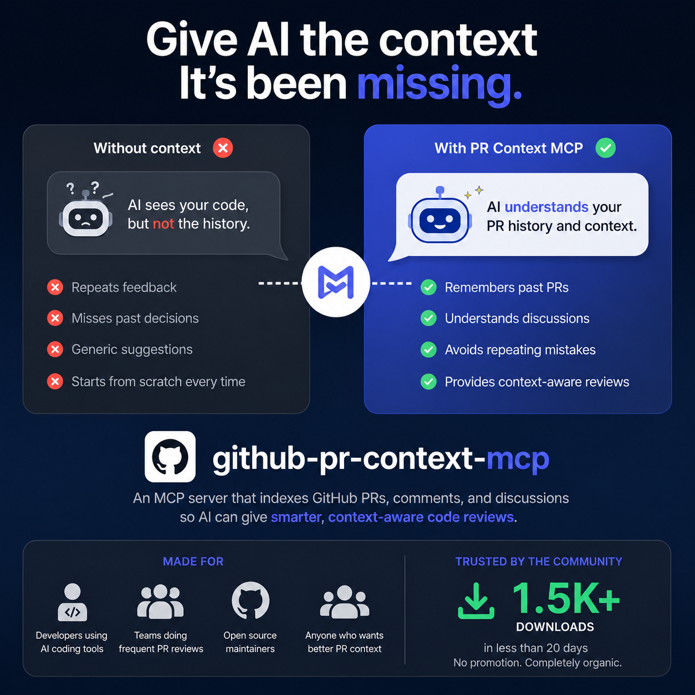

# GitHub PR Review Context MCP


> [!IMPORTANT]
> **NEW RELEASE (v0.2.9):** Integrated advanced AI tools for Test Generation, Security Auditing, Static Analysis, and Refactoring suggestions grounded in your repo history.
> ```bash
> pipx upgrade github-pr-context-mcp
> # OR
> uvx --upgrade github-pr-context-mcp
> ```

**Context layer for AI code review, grounded in your repository's real pull request history.**

---

## ❤️ Community Feedback
We want to hear from you! Your reviews help us improve and reach more developers.

👉 [**Write a Review / Share your Experience**](https://forms.gle/pEnwgcU8NXGhqKeH6)

*"This MCP is like having a teammate with perfect memory of every PR ever written."* — Example Review

---

---

## Overview

GitHub PR Review Context MCP gives AI assistants institutional review memory.

Instead of generic feedback, reviews are informed by historical reviewer comments, recurring quality patterns, and repository-specific standards from your own PR history.

### Core Value

- Improves review consistency across teams and repositories.
- Reduces repeated reviewer feedback on known issues.
- Integrates with any MCP-compatible client and multiple LLM providers.

---

## Key Capabilities

| Capability | What It Delivers |
|---|---|
| Historical review retrieval | Semantic search across prior PR comments and review summaries |
| Context-aware AI review | Feedback grounded in repository-specific review behavior |
| Grounded code generation | Generate new code based on past commits, comments, and style |
| **Team rules generation** | **Auto-generate .cursorrules / CLAUDE.md from repo history** |
| Smart repository readiness | Auto-detect indexed state and index on demand |
| Flexible storage modes | Permanent (disk) and temporary (in-memory) indexing options |
| Portable inference layer | Switch LLM providers using environment configuration only |

---

## 🚀 Quick Start

### 🚀 Zero-Setup (uvx / pipx / npx)

The fastest way to use the server. No cloning required. Just run one of these commands directly in your terminal or use them in your IDE's MCP settings:

> [!TIP]
> **Don't clone this repo to get AI rules!**
> Once installed, run `generate_repo_rules` inside **YOUR** project to automatically create `.cursorrules` or `CLAUDE.md` tailored to your own team's PR history.

**Using uvx (Recommended for speed):**
```bash
uvx github-pr-context-mcp
```

**Using pipx (Recommended for stability):**
```bash
pipx run github-pr-context-mcp
# Or install permanently:
pipx install github-pr-context-mcp
```

**Using npx (Smithery bridge):**
```bash
npx -y @smithery/cli run github-pr-context-mcp
```

---

### ⚠️ Manual Installation (Git Clone / Advanced)

> [!WARNING]
> Running from a git clone is **only recommended for developers** contributing to this project. For general use, please use the `pipx` method above.

If you have cloned the repository for development:
1. Create a virtual environment: `python -m venv .venv`
2. Activate it and install: `pip install -e .`
3. Run automatic setup: `python scripts/install_clients.py`

For full configuration (Cursor, Claude Desktop), see the [**Quick Start Guide**](docs/quickstart.md).

---

> [!IMPORTANT]
> **🚀 USE THE OFFICIAL PACKAGE:** This project is now on PyPI.
> To ensure seamless updates and zero configuration friction, do **NOT** `git clone`.
>
> **Recommended Install:**
> ```bash
> pipx install github-pr-context-mcp
> ```
> Or run instantly with: `uvx github-pr-context-mcp`

---

## 🛠️ Usage Modes: Solo vs. Team

This MCP server is built to scale from a single machine to an entire engineering organization.

### 👤 Solo Developer (Local Mode)

**Best for:** Privacy, local-first control, and zero hosting costs.
- **How it works:** Run via `uvx`, `pipx`, or a local git clone.
- **Storage:** ChromaDB stays on your local machine.
- **Security:** Your GitHub Token and LLM keys never leave your device.
- **Setup:** See [Quick Start](docs/quickstart.md#🚀-zero-setup-uvx--pipx--npx).

### 🤝 Team Collaboration (Hosted Mode — UPCOMING)

**Best for:** Scaling team-wide PR standards and centralized infra.
- **How it works:** One deployment on Render (Coming Soon) shared by the whole team.
- **Isolation:** Strict **Gmail-based namespace isolation** (driven by SQLite). User A's indexed data is mathematically invisible to User B.
- **Economics:** Pooled LLM credits and a single shared indexing server.
- **Setup:** See [Deployment Guide](docs/integrations/deployed.md).

### 🌟 Zero-Friction Setup (Upcoming)

If your team has hosted this MCP on Render, you do **NOT** need to `git clone` or install anything. Just drop this snippet into your IDE:

```json
"github-pr-context": {
  "type": "sse",
  "url": "https://YOUR-RENDER-URL.onrender.com/mcp",
  "headers": {
    "Authorization": "Bearer YOUR_TOKEN"
  }
}
```

*That's it.* If your IDE supports native MCP SSE connections, you are immediately connected to the secure Render deployment.

---

## 🧰 Core Tools Reference

The server exposes 12 core tools for IDE agents and developers. For a deep dive on when to use each, see the [**Tool Strategy Guide**](docs/tools_strategy.md).

| Tool | Action |
|---|---|
| `ensure_repo_ready` | Index a repo and ensure it's ready for queries |
| `generate_repo_rules` | **Synthesize .cursorrules / CLAUDE.md from PR history** |
| `generate_code_from_history` | Write code grounded in past commits & team style |
| `review_code_with_history` | Perform AI review grounded in team review memory |
| `generate_tests` | **Generate unit tests matching repository style** |
| `static_analysis` | **Perform human-like static analysis based on history** |
| `suggest_refactors` | **Get refactoring ideas based on clean code patterns** |
| `document_changes` | **Auto-generate documentation / docstrings** |
| `security_check` | **Audit code for vulnerabilities & compliance** |
| `get_team_review_patterns` | Summarize recurring team standards |
| `semantic_search_reviews` | Search past PR comments by meaning |
| `list_indexed_repos` | View all repos currently in storage |
| `delete_repo_index` | Free up disk space by clearing repository indices |
| `get_index_stats` | Verify if a repo index is complete |
| `get_usage_stats` | View adoption metrics and unique user counts |



---

## 📖 Documentation

Detailed guides for deep dives and specific configurations:

- 🛠️ [**Quick Start & Usage**](docs/quickstart.md) — Setup and basic commands.
- ⚙️ [**LLM Configuration**](docs/llm-configuration.md) — Switching between OpenAI, Anthropic, Gemini, and Cerebras.
- 🧩 [**Tool Strategy & Selection Guide**](docs/tools_strategy.md) — When to use which tool (for humans and agents).
- 🏗️ [**Architecture & Pipeline**](docs/architecture.md) — How the RAG engine and indexing work.
- 🔌 [**Integrations**](docs/integrations/index.md) — Connecting to Cursor, Claude Desktop, and more.

---

## 🛠️ Troubleshooting

- **"command not found"**: Use absolute paths in your configuration. Run `github-pr-context-mcp config` to get your exact path.
- **"PermissionError: [WinError 32]"**: The binary is locked by a running process. Close Claude/Cursor, run `taskkill /F /IM github-pr-context-mcp.exe`, then retry the upgrade.
- **Rate Limit Errors**: Ensure your `GITHUB_TOKEN` is valid and has `repo` scope.

---

## 📣 Community & Feedback

We want to hear from you — whether you are a solo developer or a team at a large company!

- **Feedback**: Please open an issue or start a discussion if you have ideas or encounter bugs.
- **Star ⭐**: If this tool saves you time, give it a star! It helps others find the project.
- **Corporate**: Is your team using this? Join our "Adopters" list by opening a PR to add your team's name.

---

## ⚖️ License

MIT
