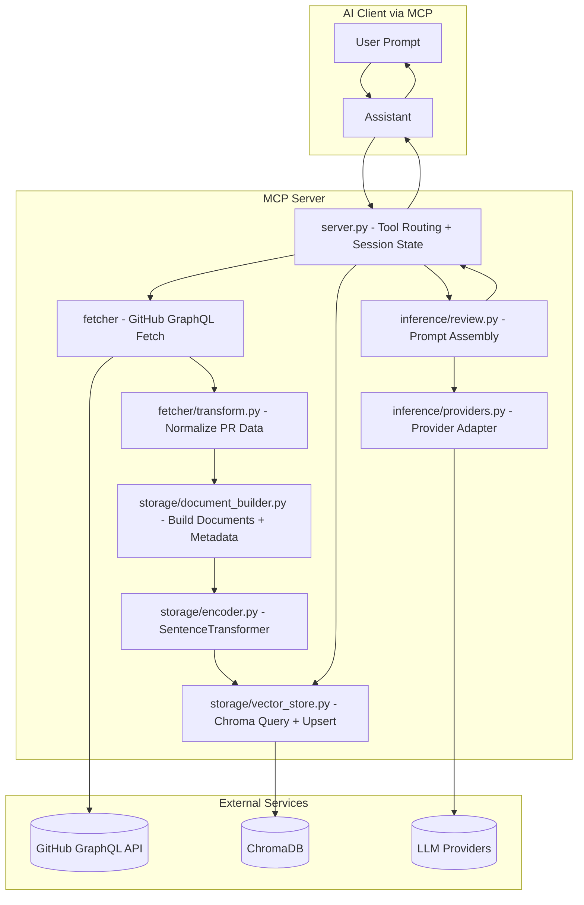
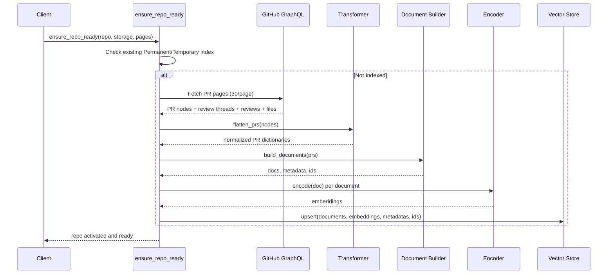
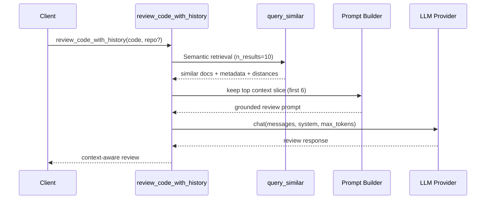

# Architecture and Tools

<div align="center">


**Context-aware code review architecture powered by retrieval from historical PR discussions.**

</div>

---

## Table of Contents

- [System Overview](#system-overview)
- [Architecture Diagram](#architecture-diagram)
- [Indexing Pipeline](#indexing-pipeline)
- [Review Pipeline](#review-pipeline)
- [Storage Design](#storage-design)
- [MCP Tools](#mcp-tools)
- [Project Structure](#project-structure)

---

## System Overview

This project turns repository PR history into semantic memory for code review.

High-level flow:
1. Fetch PR + review artifacts from GitHub GraphQL.
2. Transform them into searchable documents.
3. Embed and store in ChromaDB.
4. Retrieve relevant historical context for a new snippet/diff.
5. Generate review output through the selected LLM provider.

---

## Architecture Diagram

This diagram shows the end-to-end system topology across client, MCP server modules, and external services.



---

## Indexing Pipeline

This sequence captures the repository onboarding path when context must be fetched, transformed, embedded, and stored.



### Indexed Document Types

| Type | Source | Typical Content |
|---|---|---|
| `pr_description` | PR title/body | Feature intent, rationale, scope |
| `review_comment` | Inline thread comments | File/line-specific reviewer feedback |
| `review_summary` | Review body | High-level approval/request changes reasoning |

---

## Review Pipeline

This sequence illustrates how retrieved historical context is converted into a grounded, repository-aware review response.



### Retrieval and Prompting Notes

| Step | Implementation Detail | Why It Matters |
|---|---|---|
| Similarity metric | cosine distance converted to similarity via `1 - distance` | Human-readable relevance score |
| Retrieval depth | Top 10 retrieved, top 6 used in review prompt | Balances recall vs token budget |
| Prompt style | Senior reviewer, concrete issues, low-fluff | Better actionable review quality |

---

## Storage Design

### Permanent vs Temporary Index

| Mode | Backing Client | Persists Restart | Best Use Case |
|---|---|---|---|
| Permanent | `chromadb.PersistentClient` | Yes | Repeatedly used repositories |
| Temporary | `chromadb.EphemeralClient` | No | One-off exploration |

### Collection Naming Strategy

`owner/repo` is normalized to `owner--repo` to generate safe collection names.

---

## MCP Tools

| Tool | Primary Purpose | Key Inputs | Typical Output |
|---|---|---|---|
| `ensure_repo_ready` | Auto-load or index a repository and activate session context | `repo`, optional `storage`, optional `pages` | Active repo state + indexing summary |
| `set_active_repo` | Switch context to an already indexed repo | `repo` | Active repo switched confirmation |
| `list_indexed_repos` | List all indexed repos (both storage modes) | none | Repo list + storage labels + doc counts |
| `semantic_search_reviews` | Semantic retrieval over historical review artifacts | `query`, optional `repo`, optional `n_results` | Ranked context snippets |
| `review_code_with_history` | Generate review using retrieved team history | `code`, optional `repo` | Grounded code review text |
| `get_team_review_patterns` | Summarize recurring review patterns | optional `repo`, optional `topic` | Pattern summary |
| `get_index_stats` | Show indexed document count for a repo | optional `repo` | Stats JSON |

<details>
<summary><strong>Interactive Tool Contracts (expand)</strong></summary>

### `ensure_repo_ready`
- Checks permanent first, temporary second.
- If not found and `storage` missing, prompts user to choose permanent vs temporary.
- If storage provided, fetches PRs and indexes immediately.

### `review_code_with_history`
- Retrieves similar historical comments.
- Injects context into a review-focused system prompt.
- Calls active LLM provider adapter.

### `semantic_search_reviews`
- Returns metadata-rich snippets with similarity score.
- Useful for manual inspection before invoking full review.

</details>

---

## Project Structure

```text
github-pr-context-mcp/
├── server.py              # MCP server: tool definitions + session routing
├── indexer.py             # CLI indexer for manual pre-fetch/index
├── fetcher/
│   ├── client.py          # GraphQL client, pagination, errors
│   ├── queries.py         # GraphQL query strings
│   └── transform.py       # Raw node -> normalized PR shape
├── storage/
│   ├── encoder.py         # SentenceTransformer embedding
│   ├── document_builder.py# Build text docs/metadata/ids
│   └── vector_store.py    # Chroma indexing/query/stats
└── inference/
    ├── providers.py       # Unified multi-provider chat adapter
    └── review.py          # Prompt assembly + review/pattern summarization
```

---

Back to [README](README.md)
