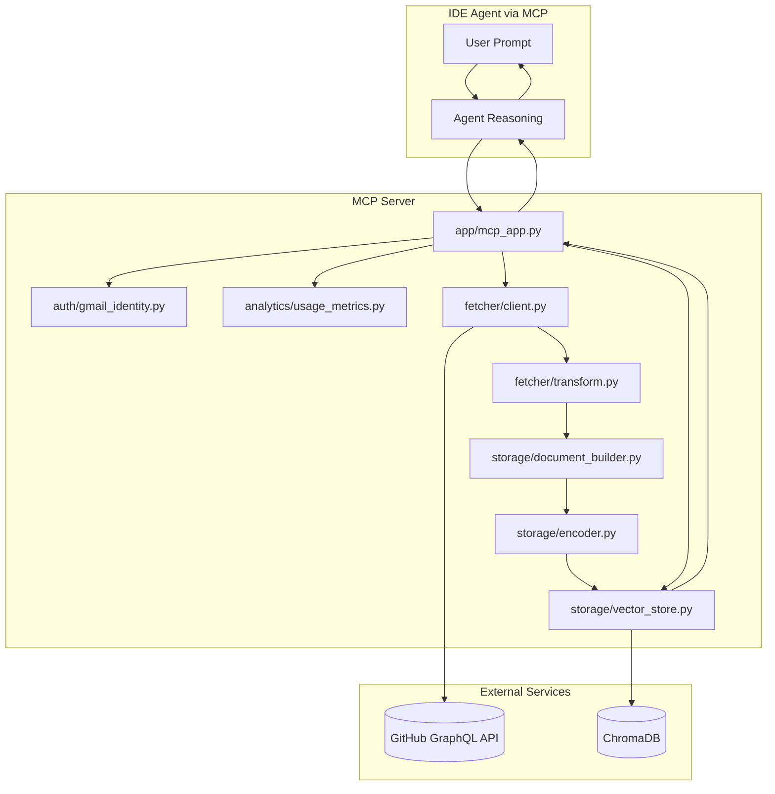
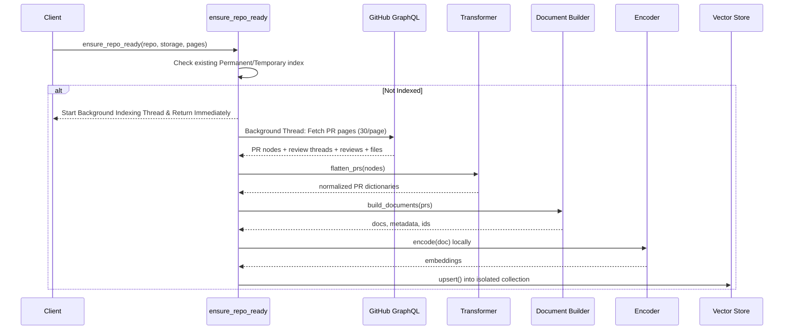
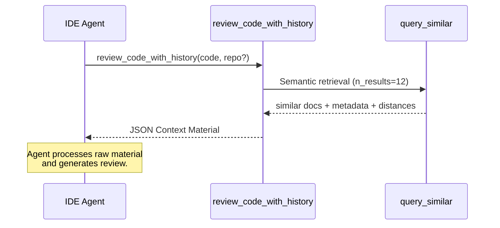

# Architecture and Tools

<div align="center">


**Pure-context architecture providing historical PR discussion retrieval to IDE agents.**

</div>

---

## Table of Contents

- [System Overview](#system-overview)
- [Architecture Diagram](#architecture-diagram)
- [Indexing Pipeline](#indexing-pipeline)
- [Retrieval Pipeline](#retrieval-pipeline)
- [Storage Design](#storage-design)
- [MCP Tools](#mcp-tools)
- [Project Structure](#project-structure)

---

## System Overview

This project turns repository PR history into semantic memory for IDE agents.

Unlike traditional RAG systems that perform inference on the server, this architecture follows a **Pure Context** model:
1. Fetch PR + review artifacts from GitHub GraphQL.
2. Transform them into searchable documents and embed them locally.
3. Store in ChromaDB.
4. Retrieve relevant historical context as **raw JSON material**.
5. The **IDE Agent** (Cursor, Claude, etc.) performs the final reasoning, review, or code generation.

---

## Architecture Diagram

This diagram shows the flow from retrieval to the IDE agent's decision-making.



### Component Legend

| Node | Responsibility |
|---|---|
| `app/mcp_app.py` | MCP tool routing, session state, background task orchestration |
| `auth/gmail_identity.py` | Role-based Gmail identity & namespace isolation (SQLite) |
| `analytics/usage_metrics.py` | Multi-source anonymous usage tracking (SQLite) |
| `fetcher/client.py` | GitHub GraphQL requests, pagination, and error handling |
| `fetcher/transform.py` | Raw PR node flattening and normalization |
| `storage/document_builder.py` | Converts PR data into searchable document records |
| `storage/encoder.py` | Local embedding generation (all-MiniLM-L6-v2) |
| `storage/vector_store.py` | Chroma upsert/query and index stats |

---

## Indexing Pipeline

This sequence captures the repository onboarding path when context must be fetched, transformed, embedded, and stored.



---

## Retrieval Pipeline

In the Pure Context model, the server provides the "evidence" and the IDE agent provides the "verdict."



---

## Storage Design

### Permanent vs Temporary Index

| Mode | Backing Client | Persists Restart | Best Use Case |
|---|---|---|---|
| Permanent | `chromadb.PersistentClient` | Yes | Repeatedly used repositories |
| Temporary | `chromadb.EphemeralClient` | No | One-off exploration |

### Collection Naming Strategy & Data Isolation

To support high-concurrency environments safely, the architecture uses **single-collection metadata isolation**. The single `owner--repo` collection holds all chunks, but uses ChromaDB's `where={"namespace": <identity>}` clause alongside `metadata["namespace"]` tags to enforce completely isolated queries per user identity.

---

## MCP Tools

| Tool | Primary Purpose | typical Output |
|---|---|---|
| `ensure_repo_ready` | Auto-load or background-index a repository | Active repo state + indexing status |
| `semantic_search_reviews` | General semantic search over historical artifacts | Raw context snippets |
| `review_code_with_history` | Retrieve context specifically for code review | JSON material + agent instruction |
| `get_team_review_patterns` | Retrieve raw material for pattern summarization | JSON patterns + agent instruction |
| `generate_code_from_history` | Retrieve context for grounded code generation | JSON context + agent instruction |
| `generate_tests` | Retrieve context for test generation | JSON patterns + agent instruction |
| `get_repo_rules_material` | Retrieve data to write .cursorrules / CLAUDE.md | High-density JSON material |

---

## Project Structure

```text
github-pr-context-mcp/
├── docs/
│   ├── architecture.md    # System design (Pure Context)
│   ├── quickstart.md      # Usage and storage guide
│   └── roadmap.md         
├── auth/
│   └── gmail_identity.py  # User identity & SQLite store
├── analytics/
│   └── usage_metrics.py   # Anonymous usage tracking
├── app/
│   ├── mcp_app.py         # MCP tool routing
│   └── tools/
│       ├── indexing.py    # Lifecycle tools
│       ├── analysis.py    # Context retrieval tools
│       └── generation.py  # Context retrieval tools
├── fetcher/
│   ├── client.py          # GitHub GraphQL logic
│   └── transform.py       # PR data normalization
└── storage/
    ├── vector_store.py    # ChromaDB & namespace isolation
    └── encoder.py         # Local embedding generation
```

---

Back to [README](../README.md)
