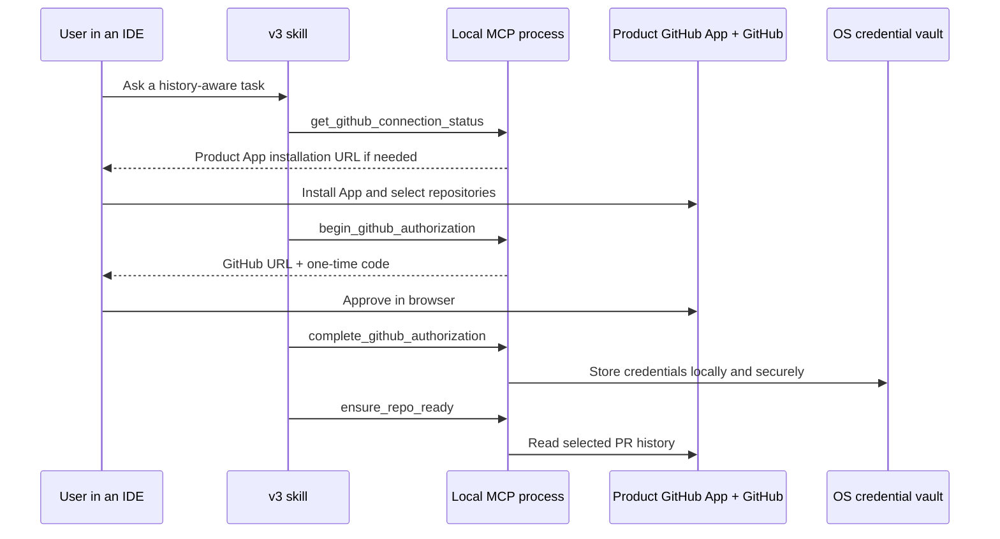

# Free local GitHub App flow

v0.3 is designed first as a **local stdio MCP**: your IDE launches the server on your computer, the PR index stays in your local ChromaDB directory, and the GitHub credential stays in your operating-system credential vault.

This is the free product path. One project maintainer creates a single public GitHub App once; every user installs and approves that App for only the repositories they choose. Users do **not** create an App or paste a personal access token.



The MCP server never returns an access token, refresh token, or private device code to the IDE agent. The one-time `user_code` is intentionally user-visible so the user can complete GitHub's browser approval.

## What the maintainer does once

1. Create a GitHub App under the project owner or organization using GitHub's [App registration guide](https://docs.github.com/en/apps/creating-github-apps/registering-a-github-app/registering-a-github-app).
2. Make it available to **any account**, enable **Device Flow**, and leave user-token expiration enabled.
3. Grant only these repository permissions:
   - **Pull requests: Read-only**
   - **Metadata: Read-only** (automatic)
4. Do not add write permissions. v0.3 reads PR titles, bodies, changed-file metadata, review threads, review comments, and commits; it does not write issues, reviews, commits, or files.
5. GitHub may require the App owner to generate a private key before the App can be installed. Generate it once and store the downloaded PEM securely, but never ship it, commit it, or configure it in a local MCP. Device Flow uses only the public Client ID.
6. Do **not** generate or ship a client secret for this local release.
7. Copy the App's public **Client ID** and App URL slug, then set them in [`auth/product_github_app.py`](../../auth/product_github_app.py):

   ```python
   PRODUCT_GITHUB_APP_CLIENT_ID = "Iv1_your_public_client_id"
   PRODUCT_GITHUB_APP_SLUG = "your-github-app-slug"
   ```

   These are public identifiers, not secrets. Commit them before building the release; do not place credentials in `.env` or a client configuration.

8. Publish the package or GitHub release. Every official build then works with the same App.

For an internal fork or temporary development build only, `GITHUB_APP_CLIENT_ID` and `GITHUB_APP_SLUG` override the bundled values. Regular users should never need those settings.

## What each user does

1. Install the MCP and add the normal local command to their IDE configuration:

   ```json
   {
     "mcpServers": {
       "github-pr-context": {
         "command": "github-pr-context-mcp"
       }
     }
   }
   ```

2. Restart the IDE and call `get_github_connection_status`.
3. If it returns `app_installation_url`, open it, install the App, and select only the repositories the MCP may read. Organization policies may require an organization administrator to approve the installation.
4. Call `begin_github_authorization`, open `verification_uri`, and enter the one-time `user_code`.
5. Call `complete_github_authorization`, then index or query a repository.

GitHub permission and user permission are both required: a user cannot read a repository merely because the App was installed. GitHub documents this intersection for [GitHub App user access tokens](https://docs.github.com/en/apps/creating-github-apps/authenticating-with-a-github-app/generating-a-user-access-token-for-a-github-app).

## Refresh, privacy, and disconnect

GitHub App Device Flow access tokens normally expire after eight hours. The local v0.3 server refreshes them automatically using the public Client ID and the refresh token held only in the OS vault; GitHub explicitly permits Device-Flow refresh without a client secret. Refresh tokens normally last six months. If a user revokes access or the refresh token expires, the MCP asks for the same browser approval again. See GitHub's [refresh-token documentation](https://docs.github.com/en/apps/creating-github-apps/authenticating-with-a-github-app/refreshing-user-access-tokens).

`disconnect_github` deletes the local vault entry and cancels any pending challenge. It does not revoke the App authorization on GitHub; the user can revoke that from GitHub settings.

Never put any of these in a downloaded/local MCP configuration:

```text
GITHUB_TOKEN
GITHUB_APP_CLIENT_SECRET
GITHUB_APP_PRIVATE_KEY
GITHUB_APP_PRIVATE_KEY_PATH
```

The local flow ignores `GITHUB_TOKEN` and rejects App secrets/keys deliberately.

## Why the public release is local, not hosted

| Free local v0.3 release | Future shared hosted service |
| --- | --- |
| User's IDE starts a local stdio process | Browser/IDE calls a remote MCP URL |
| User's OS vault stores their credential | Server needs tenant-bound encrypted credential storage/KMS |
| ChromaDB stays on the user's disk | Durable per-tenant index, job queue, and isolation are required |
| No server bill for the project | Compute, storage, monitoring, rate limits, webhook handling, and a login flow are required |

The current hosted path is intentionally not a public multi-user product. Do not put a global GitHub credential into it or point public users at it. Build that separately with tenant isolation, installation callbacks/webhooks, revocation handling, audit logs, and short-lived server-side credentials.

Back to [Configuration](configuration.md)
