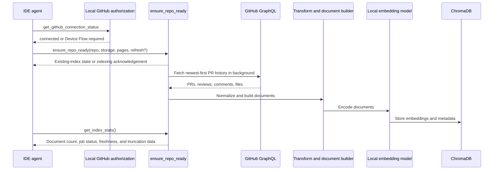
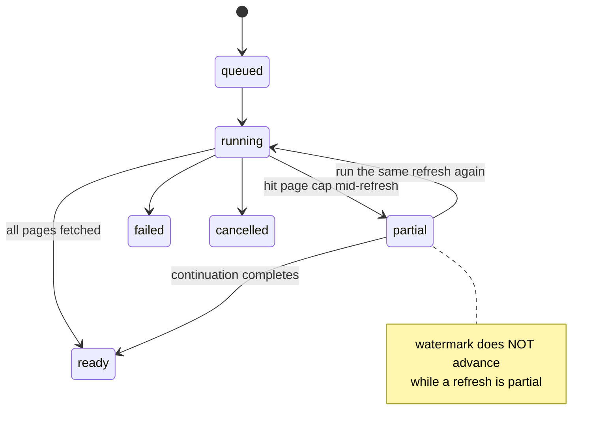
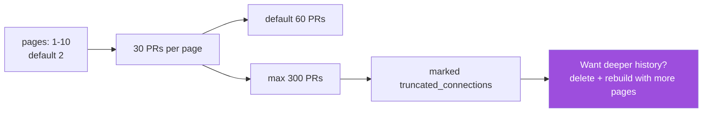
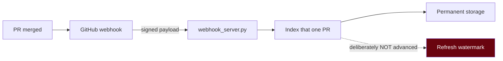
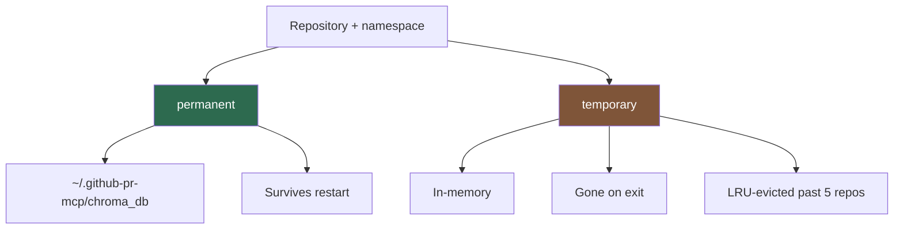
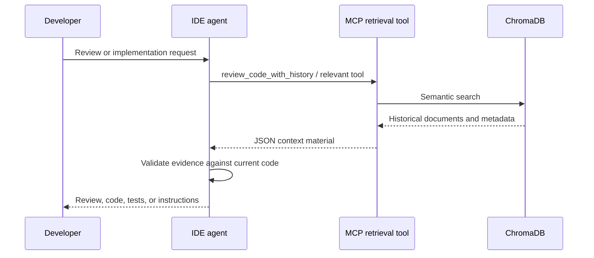
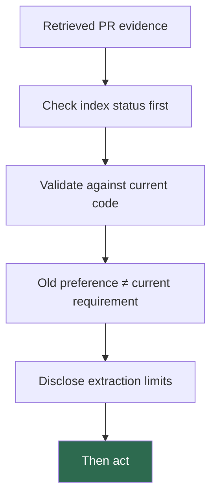
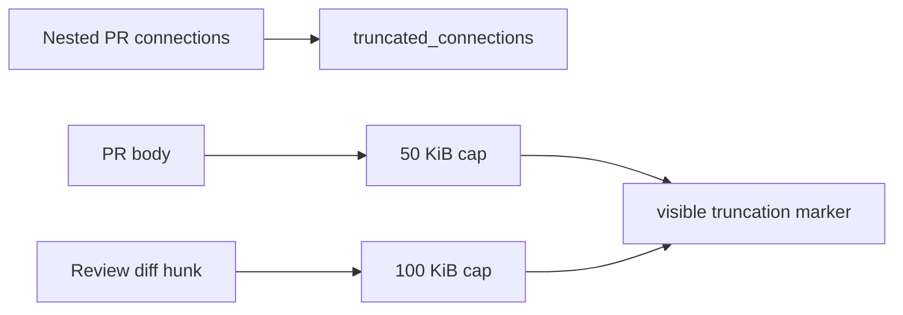

# v0.3 Pure-Context Pipeline

The server retrieves historical evidence. The connected IDE agent turns that evidence into a review, code change, test plan, or instruction file.

## Indexing



`ensure_repo_ready` starts background indexing when needed. Call it with `refresh=true` to synchronise an existing index using the GitHub `updatedAt` watermark. Use `get_index_stats` to verify that documents are available before depending on a newly requested index; its `index_job` exposes queued/running/ready/failed state and any `truncated_connections`.

### Job states



A `partial` incremental refresh saves a continuation cursor; run the same
refresh until it reports `ready`. For permanent storage that continuation
survives in local cursor state, while a temporary index must be rebuilt after a
process restart. In both cases the in-memory job display is lost on restart.

### How much history you get



A first import that reaches the cap can still finish as `ready`; its evidence
carries `truncated_connections: ["pullRequests"]` to say older history was never
fetched. **A refresh looks for newer updates — it will not backfill history
skipped by the initial cap.** If wider history matters, delete and rebuild with
a larger page count before relying on the index.

### Incremental indexing by webhook



```bash
python entrypoints/webhook_server.py
```

Add the public URL under the repository's **Settings → Webhooks** and send it
pull-request events. Set `GITHUB_WEBHOOK_SECRET` in both the environment and the
webhook configuration; when it is unset the server logs a warning and accepts
unsigned payloads, so treat it as required for any reachable deployment.

> [!IMPORTANT]
> This listener sits **outside** the supported local-stdio Device Flow path. It
> is a server process with no browser to authorize, so it reads a `GITHUB_TOKEN`
> from its own environment and cannot reach the OS vault. Run it only where you
> control that token.

Because it indexes one PR rather than a complete newest-first sweep, it
deliberately leaves the refresh watermark alone. Advancing it would let the next
`ensure_repo_ready({"refresh": true})` skip anything updated earlier that had not
yet been indexed.

### Storage and namespaces



Indexes are scoped by repository **and** namespace. Namespaces are for local
organization — they are **not** tenant isolation in a multi-user service.
Permanent cursor and refresh state lives separately, by default in
`~/.github-pr-mcp/cursors.db`.

Migrating a pre-v3 local index? Close IDE clients running this MCP, then:

```bash
github-pr-context-mcp migrate-storage --dry-run
github-pr-context-mcp migrate-storage
```

The migration copies data, leaves the old data as a backup, is safe to rerun,
and will not overwrite an unrelated nonempty v3 destination. An interrupted
migration is resumable. Inspect its JSON report for `skipped` and `conflicts`,
then restart the IDE and verify with `get_index_stats`.

## Retrieval and reasoning



The retrieval response may include an instruction field describing a useful task, but it is still historical context. The IDE agent decides whether it applies and produces the final result.

## Operational limits





- Indexing is bounded by the `pages` argument and the GitHub API response shape. When a top-level or nested connection is incomplete, v3 records `truncated_connections` alongside the evidence instead of silently treating it as complete.
- Independently of those connection limits, v3 caps an individual PR body at 50 KiB and an individual review diff hunk at 100 KiB, appending a visible truncation marker when either cap is reached.
- A historical pattern can become stale; compare it with current code and project instructions.
- The local embedding model supports semantic search. It does not replace the IDE agent's reasoning model.
- Two outbound operations are separate from GitHub retrieval: the first index or query lazily downloads the `all-MiniLM-L6-v2` embedding model, and the local launcher runs a background version check at startup.

Back to [README](../README.md)
