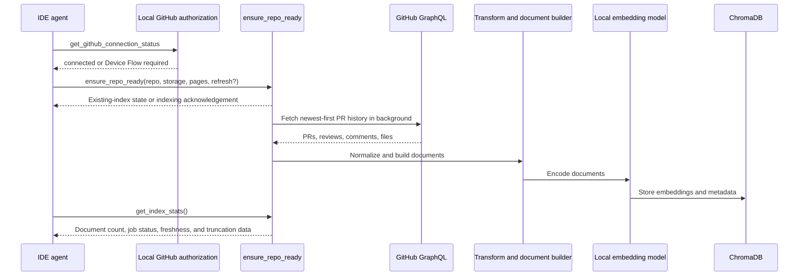
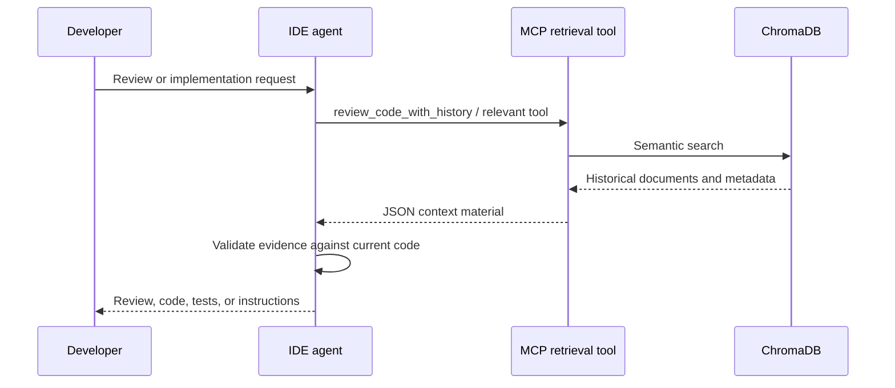

# v0.3 Pure-Context Pipeline

The server retrieves historical evidence. The connected IDE agent turns that evidence into a review, code change, test plan, or instruction file.

## Indexing

`ensure_repo_ready` starts background indexing when needed. Call it with `refresh=true` to synchronise an existing index using the GitHub `updatedAt` watermark. Use `get_index_stats` to verify that documents are available before depending on a newly requested index; its `index_job` exposes queued/running/ready/failed state and any `truncated_connections`.

## Retrieval and reasoning

The retrieval response may include an instruction field describing a useful task, but it is still historical context. The IDE agent decides whether it applies and produces the final result.

## Operational limits

- Indexing is bounded by the `pages` argument and the GitHub API response shape. When a top-level or nested connection is incomplete, v3 records `truncated_connections` alongside the evidence instead of silently treating it as complete.
- A historical pattern can become stale; compare it with current code and project instructions.
- The local embedding model supports semantic search. It does not replace the IDE agent's reasoning model.

Back to [README](../README.md)
