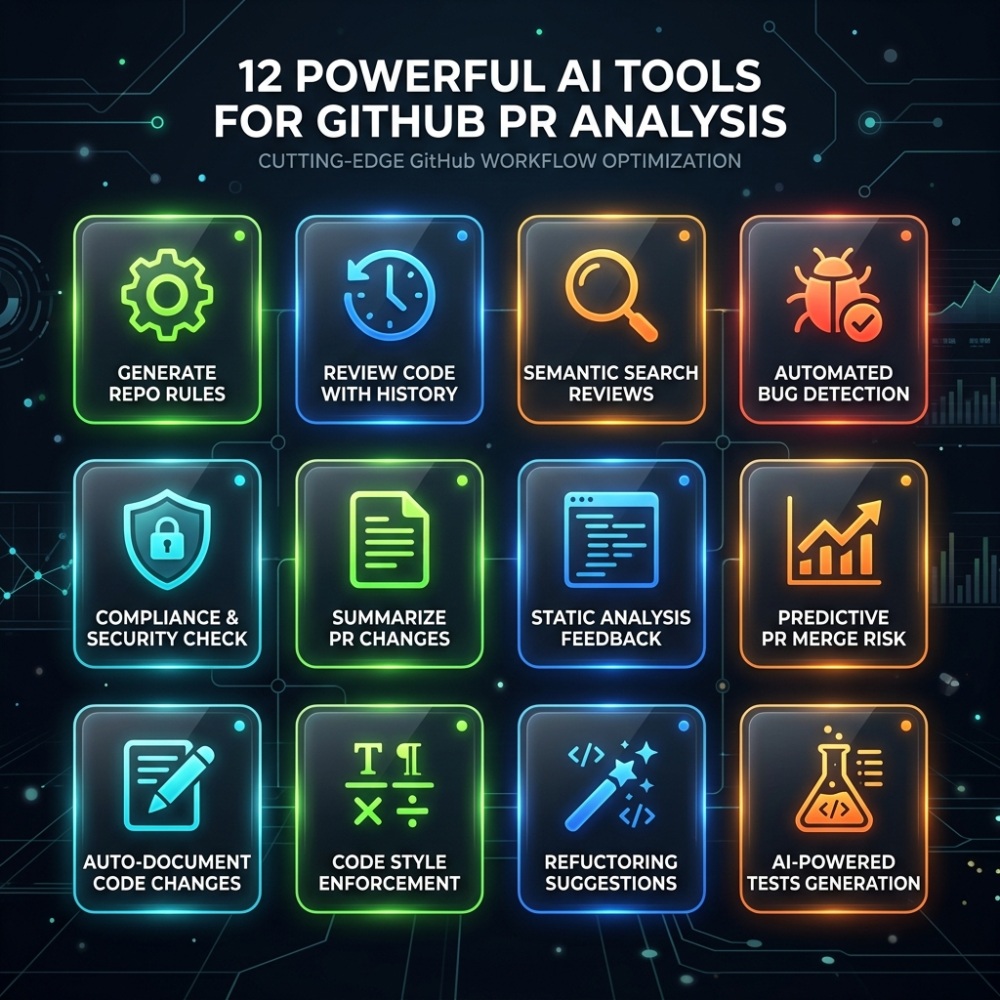

# 🛠️ Tool Strategy & Selection Guide

This guide is the **single source of truth** for all tools available in the GitHub PR Context MCP server. It is designed to be read by **both humans and AI agents**.



---

## 🤖 AI Agent Pre-Feed (JSON)

> **Agents:** Load this block first. It tells you exactly which tool to call for every situation — no guessing, no wasted turns.

```json
{
  "server": "github-pr-context-mcp",
  "version": "0.2.2",
  "instruction": "Always load this context at the start of a session. Match the user task to a 'trigger' and call the mapped tool immediately.",
  "tools": {
    "ensure_repo_ready": {
      "description": "Index a GitHub repo (or confirm it is already indexed). Handles permanent vs temporary storage trade-off explanation if storage is omitted.",
      "when_to_call": "FIRST call of any session. Any time the user mentions a repo that may not be indexed.",
      "triggers": ["new repo", "index", "load repo", "setup", "getting started"],
      "required_params": ["repo"],
      "optional_params": ["storage", "pages", "namespace"]
    },
    "set_active_repo": {
      "description": "Switch the active session repo to one that is already indexed. Does not re-index.",
      "when_to_call": "When the user says 'switch to X repo' or 'use X repo' and X is already indexed.",
      "triggers": ["switch repo", "change repo", "use repo", "activate repo"],
      "required_params": ["repo"],
      "optional_params": ["namespace"]
    },
    "list_indexed_repos": {
      "description": "List all repos that have been indexed, their storage type (permanent/temporary), and document count.",
      "when_to_call": "When the user asks 'what repos do I have?', 'what is indexed?', or before calling set_active_repo.",
      "triggers": ["list repos", "what repos", "show indexed", "which repos"],
      "required_params": [],
      "optional_params": ["namespace"]
    },
    "delete_repo_index": {
      "description": "Delete a repo's indexed data from temporary storage, permanent storage, or both.",
      "when_to_call": "When the user wants to free up space, reset a repo's index, or remove stale data.",
      "triggers": ["delete", "remove index", "clear repo", "reset index", "free space"],
      "required_params": ["repo"],
      "optional_params": ["storage", "namespace"]
    },
    "semantic_search_reviews": {
      "description": "Semantically search past PR review comments in the active repo's indexed history.",
      "when_to_call": "When the user asks a technical question about how something is done, wants past examples, or is debugging and needs historical context.",
      "triggers": ["how does X work", "find past comments", "search reviews", "what did reviewers say about", "examples of"],
      "required_params": ["query"],
      "optional_params": ["repo", "n_results", "namespace"]
    },
    "review_code_with_history": {
      "description": "Perform a context-aware AI code review grounded in the repo's real historical PR feedback patterns.",
      "when_to_call": "When the user pastes code and asks for a review, or before opening a PR.",
      "triggers": ["review this", "check my code", "is this ok", "pre-submission check", "code review"],
      "required_params": ["code"],
      "optional_params": ["repo", "namespace"]
    },
    "generate_code_from_history": {
      "description": "Generate new code for a task, grounded in the repo's historical PR commits, comments, and style patterns. Automatically loads .cursorrules / CLAUDE.md if present and injects them as hard constraints.",
      "when_to_call": "When the user asks to write, implement, or generate code for a feature. Ensures output matches team conventions. Works even better after generate_repo_rules has been run.",
      "triggers": ["write code", "implement", "generate", "create a function", "add a feature", "build"],
      "required_params": ["task"],
      "optional_params": ["repo", "namespace", "rules_file"],
      "note": "Auto-detects .cursorrules, CLAUDE.md, .github/copilot-instructions.md in the CWD. Pass rules_file explicitly to override."
    },
    "get_team_review_patterns": {
      "description": "Summarize recurring review themes and feedback patterns for a repo (e.g. 'always add tests', 'avoid magic numbers').",
      "when_to_call": "When the user wants to understand team norms, onboard to a new repo, or audit review quality.",
      "triggers": ["team patterns", "recurring feedback", "what does the team care about", "review standards", "onboard"],
      "required_params": [],
      "optional_params": ["repo", "topic", "namespace"]
    },
    "get_index_stats": {
      "description": "Return the current indexed document count and storage scope (permanent/temporary) for the active repo.",
      "when_to_call": "When the user wants to know 'how much is indexed?' or to verify an indexing job completed.",
      "triggers": ["how many docs", "index stats", "is it indexed", "check index"],
      "required_params": [],
      "optional_params": ["repo", "namespace"]
    },
    "update_settings": {
      "description": "Update personal configuration: GitHub token, LLM provider, model, or API key. Only effective in Hosted/Team mode. For local mode, direct user to update their IDE env settings.",
      "when_to_call": "When the user wants to change their GitHub token or switch LLM providers in a hosted deployment.",
      "triggers": ["change token", "update key", "switch llm", "update settings", "change provider"],
      "required_params": [],
      "optional_params": ["github_token", "llm_provider", "llm_model", "llm_api_key"],
      "note": "For local mode, tell the user to update env vars in their IDE MCP config instead."
    },
    "get_usage_stats": {
      "description": "Return anonymous usage metrics: total tool calls, unique users, and top tools used.",
      "when_to_call": "When the user or admin asks 'how many people use this?' or wants adoption analytics.",
      "triggers": ["usage stats", "how many users", "analytics", "adoption", "metrics"],
      "required_params": [],
      "optional_params": ["days", "admin_token"]
    },
    "generate_repo_rules": {
      "description": "Synthesise a .cursorrules / CLAUDE.md / copilot-instructions.md file from the repo's indexed PR history. Writes the file to disk so IDE agents auto-load team coding standards.",
      "when_to_call": "When the user wants to create or refresh the IDE rules file for a repo, or when onboarding to a new repo and wanting the agent to automatically follow team conventions.",
      "triggers": ["create rules", "generate cursorrules", "make CLAUDE.md", "create copilot instructions", "onboard agent", "save team standards"],
      "required_params": [],
      "optional_params": ["output_path", "repo", "namespace"],
      "note": "output_path defaults to '.cursorrules'. Use 'CLAUDE.md' for Claude agents or '.github/copilot-instructions.md' for GitHub Copilot."
    }
  },
  "decision_tree": {
    "start_of_session": "ensure_repo_ready",
    "switch_context": "set_active_repo",
    "audit_what_is_indexed": "list_indexed_repos",
    "user_pastes_code_for_review": "review_code_with_history",
    "user_asks_to_write_code": "generate_code_from_history",
    "user_asks_technical_question": "semantic_search_reviews",
    "understand_team_norms": "get_team_review_patterns",
    "check_index_health": "get_index_stats",
    "remove_stale_data": "delete_repo_index",
    "change_credentials": "update_settings",
    "check_adoption": "get_usage_stats",
    "create_ide_rules_file": "generate_repo_rules"
  },
  "recommended_session_flow": [
    "1. ensure_repo_ready — always first",
    "2. get_team_review_patterns (optional, to load context about the team)",
    "2b. generate_repo_rules (optional, write .cursorrules for future sessions)",
    "3. semantic_search_reviews / generate_code_from_history / review_code_with_history — based on task",
    "4. get_index_stats (optional, to verify state)"
  ]
}
```

---

## 📖 Tool Reference (Human-Readable)

### 1. `ensure_repo_ready`
> Index a GitHub repo and make it ready for queries.

- **When to use:** Always call this first for any new repo. Also call it if the repo has been updated significantly.
- **Storage options:** `permanent` (saved to disk, survives restarts) or `temporary` (in-memory, this session only). If omitted, the server will explain the trade-off.
- **Key params:** `repo` (e.g. `"psf/black"`), `pages` (depth of history, default 2), `storage`

---

### 2. `set_active_repo`
> Switch the session's active context to an already-indexed repo.

- **When to use:** When switching between multiple indexed repos without re-indexing.
- **Key params:** `repo`

---

### 3. `list_indexed_repos`
> Show all indexed repos, their storage type, and document count.

- **When to use:** To audit what is indexed, or to pick a repo before calling `set_active_repo`.

---

### 4. `delete_repo_index`
> Delete an indexed repo's data.

- **When to use:** To free disk space, reset stale data, or remove a repo you no longer need.
- **Key params:** `repo`, `storage` (`"temporary"`, `"permanent"`, or `"both"`)

---

### 5. `semantic_search_reviews`
> Find relevant past PR review comments using semantic (meaning-based) search.

- **When to use:** When you have a specific technical question ("How does the team handle rate limiting?") or want past examples.
- **Key params:** `query`, `n_results` (default 8)

---

### 6. `review_code_with_history`
> Get a context-aware code review grounded in real team feedback.

- **When to use:** Paste your code diff or snippet before opening a PR. The review is calibrated to the team's actual patterns, not generic advice.
- **Key params:** `code`

---

### 7. `generate_code_from_history`
> Generate code that matches your team's conventions and past patterns.

- **When to use:** When implementing a new feature, refactoring, or writing boilerplate. Output is grounded in historical commits and review feedback.
- **Key params:** `task` (describe what you want to build)

---

### 8. `get_team_review_patterns`
> Summarize the most common recurring review themes for a repo.

- **When to use:** To understand a team's coding standards before contributing, or to audit review consistency.
- **Key params:** `topic` (optional, e.g. `"error handling"`)

---

### 9. `get_index_stats`
> Check how many documents are indexed and in which storage scope.

- **When to use:** After indexing to verify completeness, or to diagnose why queries return sparse results.

---

### 10. `update_settings`
> Update GitHub token or LLM provider/model/key in Hosted/Team mode.

- **When to use:** Only for hosted deployments. For local mode, update env vars in your IDE's MCP config file.
- **Key params:** `github_token`, `llm_provider`, `llm_model`, `llm_api_key`

---

---

### 12. `generate_repo_rules`
> Synthesise a standards file (e.g. `.cursorrules`) from indexed PR history.

- **When to use:** When onboarding an agent to a new repo, or when you want the agent to "remember" team conventions without needing to search history every time.
- **Key params:** `output_path` (default `.cursorrules`), `repo`

---

## 🧭 Decision Matrix (Quick Reference)

| Scenario | Tool |
| :--- | :--- |
| First time with a repo | `ensure_repo_ready` |
| Switch between indexed repos | `set_active_repo` |
| See what is indexed | `list_indexed_repos` |
| Remove stale index | `delete_repo_index` |
| Ask a technical question | `semantic_search_reviews` |
| Review code before a PR | `review_code_with_history` |
| Write new code that fits team style | `generate_code_from_history` |
| **Pre-load team standards to IDE** | `generate_repo_rules` |
| Learn team coding standards | `get_team_review_patterns` |
| Verify index is complete | `get_index_stats` |
| Change token or LLM (hosted only) | `update_settings` |
| Check adoption analytics | `get_usage_stats` |

---

## 🚀 Resolving Installation Path Issues

A common problem in MCP setups is the "command not found" error because IDEs need the **absolute path** to the binary.

### The One-Click Solution

```bash
github-pr-context-mcp config
```

This auto-detects your OS and binary path and outputs a ready-to-paste IDE config snippet.

### Example Output
```json
{
  "mcpServers": {
    "github-pr-context": {
      "command": "C:\\Users\\YourName\\.local\\bin\\github-pr-context-mcp.exe",
      "env": {
        "GITHUB_TOKEN": "YOUR_GITHUB_TOKEN",
        "LLM_PROVIDER": "cerebras",
        "LLM_API_KEY": "YOUR_LLM_API_KEY"
      }
    }
  }
}
```
**Just copy, paste, and replace your keys.** No more hunting for paths!
