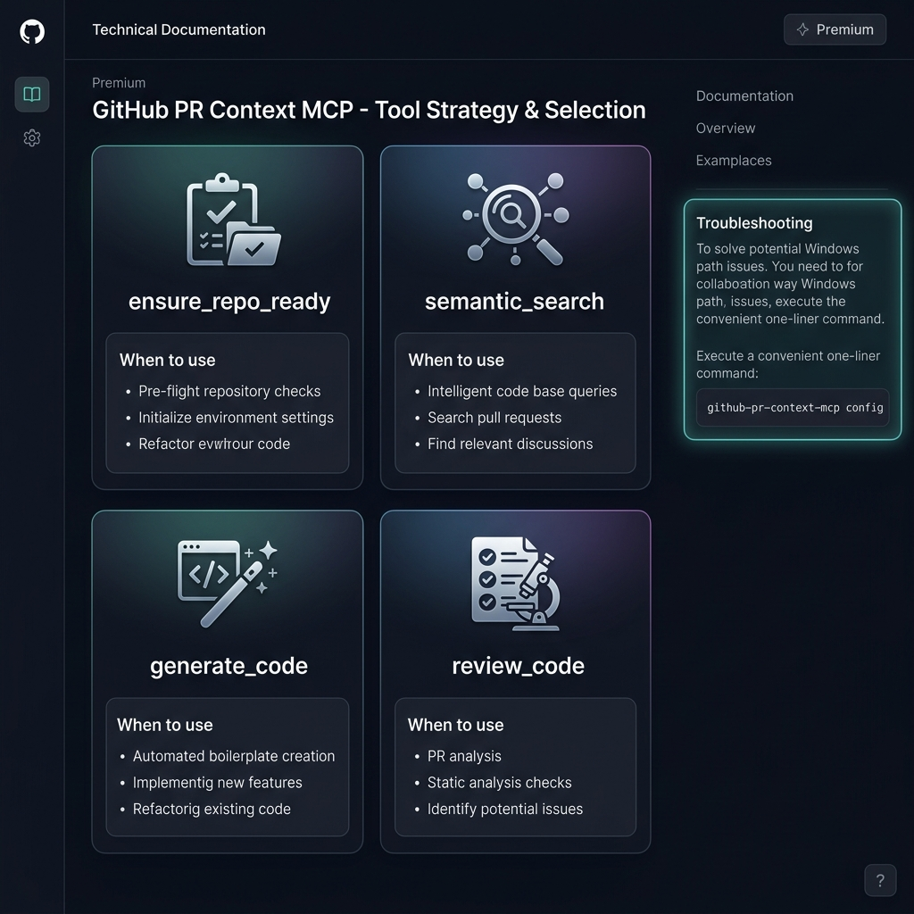

# 🛠️ Tool Strategy & Selection Guide

This guide helps both humans and AI agents understand which tool to use for different scenarios in the GitHub PR Context MCP ecosystem.



---

## 🧭 Decision Matrix

| Scenario | Recommended Tool | Why? |
| :--- | :--- | :--- |
| **First time** using a repo | `ensure_repo_ready` | Triggers indexing and sets the active session context. |
| Asking **technical questions** | `semantic_search_reviews` | Finds specific past discussions or code examples related to your query. |
| **Writing new code** | `generate_code_from_history` | Ensures the new code matches the team's style, naming, and architecture. |
| **Pre-submission** check | `review_code_with_history` | Simulates a team review to catch common mistakes before they hit GitHub. |
| Learning **team culture** | `get_team_review_patterns` | Surfaces the most frequent feedback points and reviewer priorities. |

---

## 🚀 Resolving Installation Path Issues

A common problem in MCP setups is the "command not found" error because IDEs (Claude Desktop, Cursor) need the **absolute path** to the binary.

### The One-Click Solution
We've added a helper command that detects your exact installation path and generates a perfectly formatted config snippet.

Run this in your terminal:
```bash
github-pr-context-mcp config
```

### Example Output
The command will output something like this:
```json
{
  "mcpServers": {
    "github-pr-context": {
      "command": "C:\\Users\\YourName\\.local\\bin\\github-pr-context-mcp.exe",
      "env": {
        "GITHUB_TOKEN": "YOUR_GITHUB_TOKEN",
        "LLM_PROVIDER": "cerebras",
        "LLM_API_KEY": "YOUR_LLM_API_KEY"
      }
    }
  }
}
```
**Just copy, paste, and replace your keys.** No more hunting for paths!
