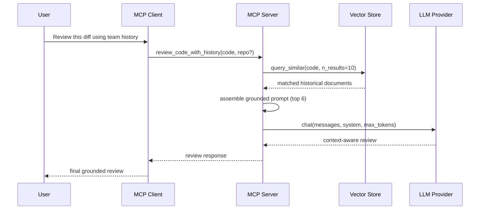
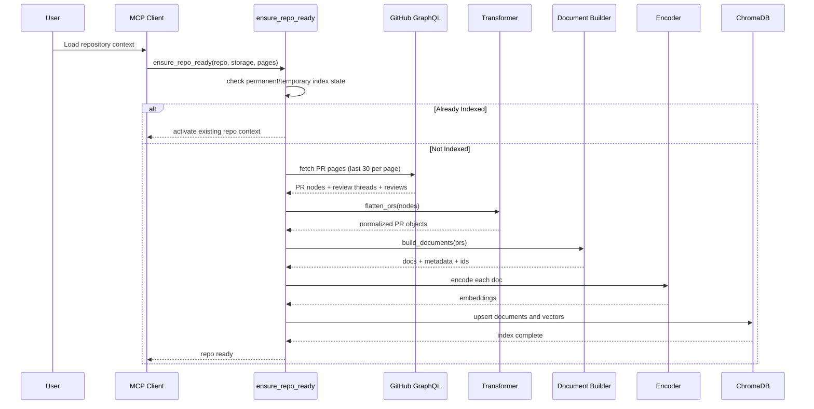
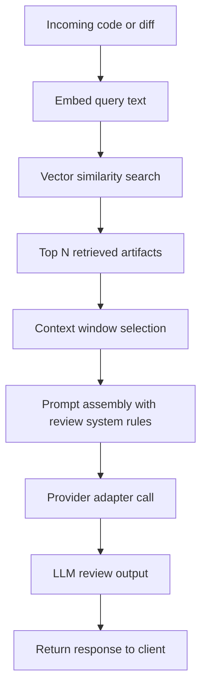

# Pipeline Deep Dive

**End-to-end operational flows for indexing, retrieval, and grounded review generation.**

---

## Table of Contents

- [Query Flow](#query-flow)
- [Indexing Flow](#indexing-flow)
- [Retrieval and Generation Flow](#retrieval-and-generation-flow)

---

## Query Flow

This flow shows request-time retrieval and response generation for grounded code review.

---

## Indexing Flow

This flow shows repository indexing when context is missing from local storage.

---

## Retrieval and Generation Flow

This flow summarizes the core RAG loop used during review generation.

### Operational Notes

| Stage | Current Behavior | Practical Impact |
|---|---|---|
| Retrieval depth | `n_results=10` from vector search | Strong recall with manageable token budget |
| Prompt context | Top 6 matches used in review prompt | Keeps output focused and grounded |
| Similarity score | Derived from cosine distance (`1 - distance`) | Easier ranking interpretation |
| Storage mode | Permanent or ephemeral | Flexible trade-off between speed and persistence |

---

Back to [README](README.md)
